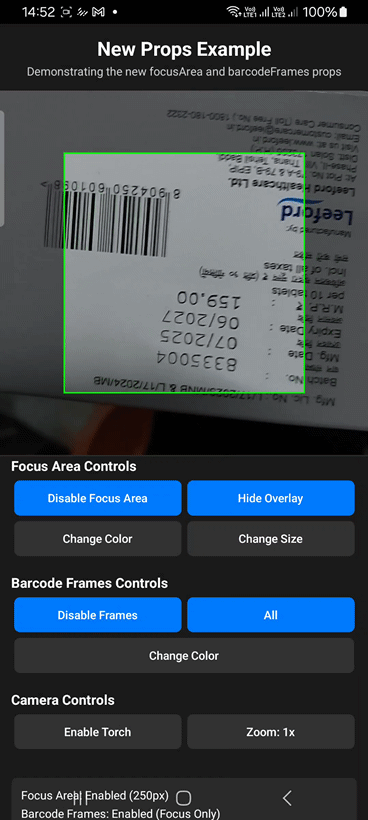

<div align="center">

# 📱 React Native Scanner

**A powerful, native barcode and QR code scanner for React Native**



[](https://www.npmjs.com/package/@cleanuidev/react-native-scanner)
[](https://opensource.org/licenses/MIT)
[](https://reactnative.dev/)
[](https://reactnative.dev/)

**Built with ❤️ by [CleanUI.dev](https://cleanui.dev)**

[Features](#-features) • [Installation](#-installation) • [Documentation](#-documentation)

</div>

---

## ✨ Features

<div align="center">

| Feature | Description |
|:------:|:-----------|
| 🚀 **Native Performance** | Built with CameraX & ML Kit (Android) and AVFoundation & Vision (iOS) for optimal performance |
| 🎯 **Focus Area** | Configurable focus area with optional overlay for precise scanning |
| 🔦 **Torch Control** | Built-in flashlight/torch control |
| 📊 **Multiple Formats** | Support for QR codes, Code128, Code39, EAN, UPC, and more |
| 🎨 **Customizable** | Configurable focus area colors, barcode frame visualization, and scanning behavior |
| 📱 **Cross Platform** | Android & iOS support (new Fabric architecture) |

</div>

---

## 📦 Installation

### Install Beta Version

Currently, the library is in beta. Install the beta version using:

```bash
npm install @cleanuidev/react-native-scanner@beta
# or
yarn add @cleanuidev/react-native-scanner@beta
```

### Install Specific Version

To install a specific beta version:

```bash
npm install @cleanuidev/react-native-scanner@1.0.0-beta.1
# or
yarn add @cleanuidev/react-native-scanner@1.0.0-beta.1
```

> **Note**: Once the library reaches stable release (1.0.0), you can install it without the `@beta` tag:
> ```bash
> npm install @cleanuidev/react-native-scanner
> # or
> yarn add @cleanuidev/react-native-scanner
> ```

## Platform Setup

### Android Setup

Add the following permissions to your `android/app/src/main/AndroidManifest.xml`:

```xml
<uses-permission android:name="android.permission.CAMERA" />
<uses-permission android:name="android.permission.WAKE_LOCK" />
<uses-feature android:name="android.hardware.camera" android:required="true" />
<uses-feature android:name="android.hardware.camera.autofocus" android:required="false" />
<uses-feature android:name="android.hardware.camera.flash" android:required="false" />
```

### iOS Setup

For iOS, add camera usage description to your `ios/YourApp/Info.plist`:

```xml
<key>NSCameraUsageDescription</key>
<string>This app needs camera access to scan barcodes and QR codes</string>
```

Then install CocoaPods dependencies:

```bash
cd ios && pod install && cd ..
```

## Usage

### Basic Scanner

```tsx
import React from 'react';
import { View, StyleSheet } from 'react-native';
import ScannerView, { BarcodeFormat } from '@cleanuidev/react-native-scanner';

export default function App() {
  const handleBarcodeScanned = (event) => {
    console.log('Scanned:', event.nativeEvent.data);
  };

  return (
    <View style={styles.container}>
      <ScannerView
        style={styles.scanner}
        barcodeTypes={[BarcodeFormat.QR_CODE, BarcodeFormat.CODE_128]}
        onBarcodeScanned={handleBarcodeScanned}
      />
    </View>
  );
}

const styles = StyleSheet.create({
  container: {
    flex: 1,
  },
  scanner: {
    flex: 1,
  },
});
```

### Scanner with Focus Area

```tsx
import React, { useState } from 'react';
import { View, StyleSheet, TouchableOpacity, Text } from 'react-native';
import ScannerView, { BarcodeFormat } from '@cleanuidev/react-native-scanner';

export default function FocusAreaScanner() {
  const [torchEnabled, setTorchEnabled] = useState(false);
  
  // Focus area configuration
  const focusAreaConfig = {
    enabled: true,        // Only scan barcodes within the focus area
    showOverlay: true,    // Show the focus area overlay
    size: 300,           // Size of the focus area (square)
    color: '#00FF00',    // Color of the focus area border
  };

  // Barcode frames configuration
  const barcodeFramesConfig = {
    enabled: true,        // Show frames around detected barcodes
    color: '#FF0000',     // Color of barcode frames
    onlyInFocusArea: false, // Show frames for all barcodes
  };

  return (
    <View style={styles.container}>
      <ScannerView
        style={styles.scanner}
        barcodeTypes={[
          BarcodeFormat.QR_CODE,
          BarcodeFormat.CODE_128,
          BarcodeFormat.EAN_13,
          BarcodeFormat.UPC_A,
        ]}
        focusArea={focusAreaConfig}
        barcodeFrames={barcodeFramesConfig}
        torch={torchEnabled}
        onBarcodeScanned={(event) => {
          console.log('Scanned:', event.nativeEvent.data);
        }}
        onScannerError={(event) => {
          console.error('Error:', event.nativeEvent.error);
        }}
        onLoad={(event) => {
          console.log('Scanner loaded:', event.nativeEvent.success);
        }}
      />
      
      <View style={styles.controls}>
        <TouchableOpacity 
          style={styles.button} 
          onPress={() => setTorchEnabled(!torchEnabled)}
        >
          <Text>Toggle Torch</Text>
        </TouchableOpacity>
      </View>
    </View>
  );
}
```

## API Reference

### Props

| Prop | Type | Default | Description |
|------|------|---------|-------------|
| `barcodeTypes` | `BarcodeFormat[]` | `[BarcodeFormat.QR_CODE]` | Array of barcode formats to scan |
| `focusArea` | `FocusAreaConfig` | - | Focus area configuration |
| `barcodeFrames` | `BarcodeFramesConfig` | - | Barcode frame visualization configuration |
| `torch` | `boolean` | `false` | Enable/disable torch/flashlight |
| `zoom` | `number` | `1.0` | Camera zoom level |
| `pauseScanning` | `boolean` | `false` | Pause/resume scanning |
| `barcodeScanStrategy` | `BarcodeScanStrategy` | `BarcodeScanStrategy.ALL` | Strategy for processing multiple detected barcodes |
| `keepScreenOn` | `boolean` | `true` | Keep screen on while camera is active (prevents auto-lock) |
| `onBarcodeScanned` | `function` | - | Callback when barcode is scanned |
| `onScannerError` | `function` | - | Callback when scanner encounters an error |
| `onLoad` | `function` | - | Callback when scanner is loaded |

#### FocusAreaConfig

```tsx
type FocusAreaConfig = {
  enabled?: boolean;        // Whether to restrict scanning to focus area only
  size?: FrameSize;         // Size of the focus area
  color?: string;           // Color of focus area border
  showOverlay?: boolean;    // Whether to draw the focus area overlay
};
```

#### BarcodeFramesConfig

```tsx
type BarcodeFramesConfig = {
  enabled?: boolean;        // Whether to draw frames around detected barcodes
  color?: string;           // Color of barcode frames
  onlyInFocusArea?: boolean; // Only show frames for barcodes in focus area
};
```

#### FrameSize

```tsx
type FrameSize = number | { width: number; height: number };
// number: square frame (e.g., 300)
// object: rectangular frame (e.g., { width: 300, height: 200 })
```

#### BarcodeScanStrategy

```tsx
import { BarcodeScanStrategy } from '@cleanuidev/react-native-scanner';

// Available strategies:
BarcodeScanStrategy.ONE              // Process only the first barcode detected
BarcodeScanStrategy.ALL              // Process all detected barcodes
BarcodeScanStrategy.BIGGEST          // Process only the largest barcode by area
BarcodeScanStrategy.SORT_BY_BIGGEST  // Process all barcodes sorted by size (largest first)
```

### Barcode Formats

```tsx
import { BarcodeFormat } from '@cleanuidev/react-native-scanner';

// Available formats:
BarcodeFormat.QR_CODE        // QR Code
BarcodeFormat.CODE_128       // Code 128
BarcodeFormat.CODE_39        // Code 39
BarcodeFormat.EAN_13         // EAN-13
BarcodeFormat.EAN_8          // EAN-8
BarcodeFormat.UPC_A          // UPC-A
BarcodeFormat.UPC_E          // UPC-E
BarcodeFormat.DATA_MATRIX    // Data Matrix
BarcodeFormat.PDF_417        // PDF417
BarcodeFormat.AZTEC          // Aztec
BarcodeFormat.ITF            // ITF (Interleaved 2 of 5)
```

### Event Payloads

#### onBarcodeScanned
```tsx
{
  nativeEvent: [
    {
      data: string;           // The scanned barcode data
      format: BarcodeFormat;  // The format of the scanned barcode
      timestamp: number;      // Timestamp when scanned
      boundingBox?: {         // Bounding box coordinates (if available)
        left: number;
        top: number;
        right: number;
        bottom: number;
      };
      area?: number;          // Area of the barcode (if available)
    }
  ]
}
```

#### onScannerError
```tsx
{
  nativeEvent: {
    error: string;          // Error message
    code: string;           // Error code
  }
}
```

#### onLoad
```tsx
{
  nativeEvent: {
    success: boolean;       // Whether scanner loaded successfully
    error?: string;         // Error message if loading failed
  }
}
```

## Focus Area Configuration

The focus area feature provides precise control over where barcodes are scanned:

### Basic Focus Area

```tsx
<ScannerView
  focusArea={{
    showOverlay: true,    // Show visual overlay
    size: 300,           // 300x300 pixel square
    color: '#00FF00',    // Green border
  }}
  // Scans entire camera view
/>
```

### Focus Area with Restricted Scanning

```tsx
<ScannerView
  focusArea={{
    enabled: true,        // Only scan within focus area
    showOverlay: true,    // Show visual overlay
    size: 300,           // 300x300 pixel square
    color: '#00FF00',    // Green border
  }}
  // Only scans within the focus area
/>
```

### Rectangular Focus Area

```tsx
<ScannerView
  focusArea={{
    enabled: true,
    showOverlay: true,
    size: { width: 300, height: 200 }, // Rectangular focus area
    color: '#00FF00',
  }}
/>
```

## Barcode Frame Visualization

The scanner can display visual frames around detected barcodes to help users see what's being scanned:

### Show All Barcode Frames

```tsx
<ScannerView
  barcodeFrames={{
    enabled: true,
    color: '#FF0000',     // Red frames
    onlyInFocusArea: false, // Show frames for all barcodes
  }}
/>
```

### Show Frames Only in Focus Area

```tsx
<ScannerView
  focusArea={{
    enabled: true,
    showOverlay: true,
    size: 300,
  }}
  barcodeFrames={{
    enabled: true,
    color: '#FF0000',
    onlyInFocusArea: true, // Only show frames for barcodes in focus area
  }}
/>
```

## Barcode Scan Strategy

The scanner now supports different strategies for processing multiple detected barcodes. The `onBarcodeScanned` event always returns an array of barcodes, even when only one barcode is processed.

### Process All Barcodes (Default)

```tsx
<ScannerView
  barcodeScanStrategy={BarcodeScanStrategy.ALL}
  onBarcodeScanned={(event) => {
    const barcodes = event.nativeEvent;
    console.log(`Found ${barcodes.length} barcodes:`, barcodes);
  }}
/>
```

### Process Only the First Barcode

```tsx
<ScannerView
  barcodeScanStrategy={BarcodeScanStrategy.ONE}
  onBarcodeScanned={(event) => {
    const barcodes = event.nativeEvent;
    // Will always have 0 or 1 barcode
    if (barcodes.length > 0) {
      console.log('First barcode:', barcodes[0]);
    }
  }}
/>
```

### Process Only the Largest Barcode

```tsx
<ScannerView
  barcodeScanStrategy={BarcodeScanStrategy.BIGGEST}
  onBarcodeScanned={(event) => {
    const barcodes = event.nativeEvent;
    // Will always have 0 or 1 barcode (the largest one)
    if (barcodes.length > 0) {
      console.log('Largest barcode:', barcodes[0]);
      console.log('Area:', barcodes[0].area);
    }
  }}
/>
```

### Process All Barcodes Sorted by Size

```tsx
<ScannerView
  barcodeScanStrategy={BarcodeScanStrategy.SORT_BY_BIGGEST}
  onBarcodeScanned={(event) => {
    const barcodes = event.nativeEvent;
    // Barcodes are sorted from largest to smallest
    barcodes.forEach((barcode, index) => {
      console.log(`Barcode ${index + 1}:`, barcode.data, 'Area:', barcode.area);
    });
  }}
/>
```

## Torch Control

The torch/flashlight can be controlled via the `torch` prop:

```tsx
const [torchEnabled, setTorchEnabled] = useState(false);

<ScannerView
  torch={torchEnabled}
  // ... other props
/>
```

## Keep Screen On

The scanner automatically keeps the screen on while the camera is active to prevent auto-lock during scanning sessions. This behavior can be controlled via the `keepScreenOn` prop:

### Default Behavior (Screen Stays On)

```tsx
<ScannerView
  keepScreenOn={true} // Default behavior
  onBarcodeScanned={handleBarcodeScanned}
/>
```

### Allow Screen Auto-Lock

```tsx
<ScannerView
  keepScreenOn={false} // Allow screen to auto-lock
  onBarcodeScanned={handleBarcodeScanned}
/>
```

### Dynamic Control

```tsx
const [keepScreenOn, setKeepScreenOn] = useState(true);

<ScannerView
  keepScreenOn={keepScreenOn}
  onBarcodeScanned={handleBarcodeScanned}
/>

// Toggle button
<TouchableOpacity onPress={() => setKeepScreenOn(!keepScreenOn)}>
  <Text>{keepScreenOn ? 'Disable Keep Screen On' : 'Enable Keep Screen On'}</Text>
</TouchableOpacity>
```

**Note**: The screen is kept on by default (`keepScreenOn={true}`) as this is typically desired for scanning applications. When disabled, the screen may auto-lock, which could interrupt scanning sessions.

## 🎨 UI Design Note

> **💡 Note**: The native overlays and frames are provided to fulfill minimum design requirements and for debugging during development. We **recommend implementing custom React Native UI** for enhanced user experiences.

To use custom UI, simply disable the native visual overlays and build your own:

```tsx
<ScannerView
  focusArea={{ enabled: true, showOverlay: false }} // Disable native overlay
  barcodeFrames={{ enabled: false }} // Disable native frames
  onBarcodeScanned={handleBarcodeScanned}
/>
```

## Permissions

The scanner requires camera permissions. Make sure to request camera permissions in your app before using the scanner:

```tsx
import { PermissionsAndroid, Platform } from 'react-native';

const requestCameraPermission = async () => {
  if (Platform.OS === 'android') {
    try {
      const granted = await PermissionsAndroid.request(
        PermissionsAndroid.PERMISSIONS.CAMERA,
        {
          title: "Camera Permission",
          message: "This app needs camera access to scan barcodes",
          buttonNeutral: "Ask Me Later",
          buttonNegative: "Cancel",
          buttonPositive: "OK"
        }
      );
      return granted === PermissionsAndroid.RESULTS.GRANTED;
    } catch (err) {
      console.warn(err);
      return false;
    }
  }
  return true;
};
```

## Example

See the `example/` directory for complete working examples, including the "New Props Example" that demonstrates the updated prop structure.

## Contributing

1. Fork the repository
2. Create your feature branch (`git checkout -b feature/amazing-feature`)
3. Commit your changes (`git commit -m 'Add some amazing feature'`)
4. Push to the branch (`git push origin feature/amazing-feature`)
5. Open a Pull Request

## 💼 Consulting & Support

### Community Support (Free)

For bug reports, feature requests, and general questions:
- 📝 [Open an issue](https://github.com/cleanui-dev/react-native-scanner/issues) on GitHub
- 💬 Use GitHub Discussions for questions and community help

### Commercial Support & Consulting

Need professional help with implementation, custom development, or enterprise support?

- 📧 **Email**: [contact@cleanuitechnologies.com](mailto:contact@cleanuitechnologies.com)
- 🌐 **Company**: [cleanui.dev](https://cleanui.dev)

**We offer:**
- ✅ Custom implementation assistance
- ✅ Enterprise support and SLA
- ✅ Feature development and customization
- ✅ Code reviews and architecture consulting

---

## License

This project is licensed under the MIT License - see the [LICENSE](LICENSE) file for details.

---

Made with [create-react-native-library](https://github.com/callstack/react-native-builder-bob)
